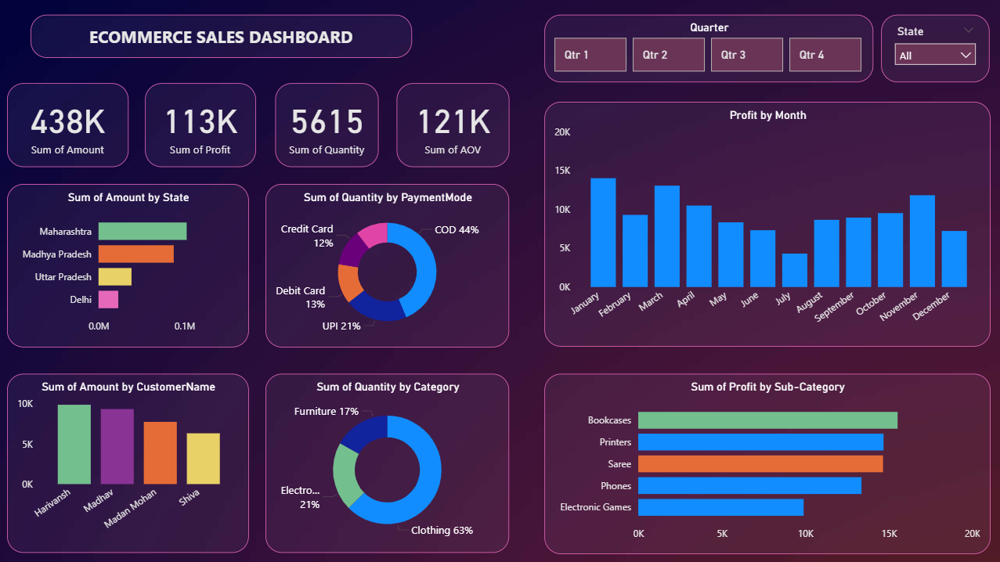

# Store-Sales-Analysis-Dashboard
Power BI dashboard analyzing store sales performance, customer orders, and revenue trends

An interactive **Power BI dashboard** analyzing store sales performance, order trends, customers, products, and regions.  
This repo includes the PBIX plus clean source CSVs so others can reproduce the visuals.

---

## 🚀 Project Highlights
- **Period:** 2018-01-01 → 2018-12-31  
- **Orders:** 500 (1,500 line items)  
- **Totals:** Sales **437,771** · Profit **36,963** · Quantity **5,615**  
- **Top Categories (by Sales):** Electronics (166,267), Clothing (144,323), Furniture (127,181)  
- **Top Sub-Categories:** Printers (59,252), Saree (59,094), Bookcases (56,861), Phones (46,119), Electronic Games (39,168)  
- **Top States:** Maharashtra (102,498), Madhya Pradesh (87,463), Uttar Pradesh (38,362), Delhi (22,957), Rajasthan (22,334)

> Numbers are computed by joining `Orders.csv` and `Details.csv` on **Order ID**.

---

## 🖥️ Dashboard Preview

---

## 📂 Repository Structure
